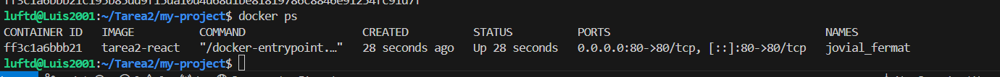
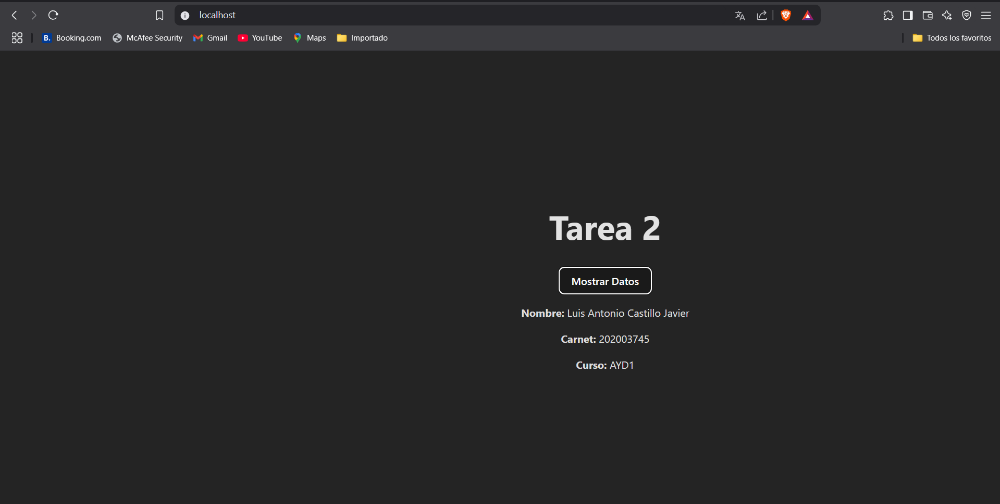

# Tarea 2 AYD1


## Comandos para el despliegue de docker

## Requisitos

- Docker instalado

## Pasos para ejecutar

1. Construir la imagen de Docker:

```shell
docker build -t tarea2-react .
```

2. Dockerfile usado

```dockerfile

FROM node:18 AS build
WORKDIR /app

COPY package.json package-lock.json ./
RUN npm install
COPY . .


RUN npm run build


FROM nginx:alpine
COPY --from=build /app/dist /usr/share/nginx/html


EXPOSE 80


CMD ["nginx", "-g", "daemon off;"]

```


3. Ejectuar el contenedor

```shell
docker run -d -p 80:80 tarea2-react
```

4. Verificar que el contenedor se haya construido bien



5. Poner en el navegador localhost para verificar la pagina



Listo, eso sería todo de la tarea 2 :).
